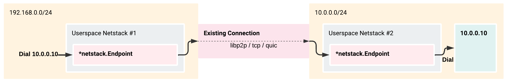

RemoteNetstack provides utilities for running user-space network stacks where the data link layer implementation only needs to implement the [`io.Reader`](https://pkg.go.dev/io#Reader) and [`io.Writer`](https://pkg.go.dev/io#Writer) interfaces. This single abstraction allows for interesting functionality, like the ability to dial through an existing connection, and out of a user-space networking stack located on another physical machine, effectively acting as a remote network interface.



This project maintains the core primitive that makes this work [`netstack.Endpoint`](./netstack/endpoint.go) as well as some other useful utilities.
* Custom data link layer [using libp2p streams](#libp2p) as the underlying transport. Any libp2p host can be used as a data link layer by attaching a custom stream handler. This pattern can also be used to make other data link layer implementations like a QUIC-based implementation (coming soon).
* Create HTTP clients using a netstack as the underlying transport.
* Custom TCP and UDP forwarding implementations which allow netstacks to forward TCP requests to the host's TCP stack.

These primitives aim to be un-opinionated in order to be flexible, at the cost of requiring a bit more manual plumbing to implement; for example, none of the primitives create a netstack for you, they accept only the netstack's endpoint as a parameter, but require you to configure and maintain the actual netstack.

This project is extremely experimental. While most of the heavy lifting is being performed by production-ready projects like gvisor's netstack, and libp2p, the APIs exposed in this project will change until the first major release.

## Use Cases
* TCP/UDP tunneling without the need to configure the tunnel endpoint up-front. The userspace netstack allows callers to dial through to any IP address supported by the netstacks routing table.
* Remote network interface. This allows you to put a "exit network interface" on one machine, an "entrance network interface" on another machine, connect the two somehow (libp2p, quic, tcp, etc) and then make network connections from the "entrance network interface" as if you were making connections from the "exit network interface".
* As a pluggable package in an existing project to provide VPN-like functionality on top of already-secured and authorized connections.

## Example
The following example creates two userspace netstacks, one with the IP address 10.0.0.1 and a routing rule that handles all traffic to 192.168.1.0/24, and the other with an IP address of 192.168.1.1 and a routing rule that handles all traffic (0.0.0.0/0). The two netstacks are connected in memory. All packets written two the first netstack's endpoint are read from the second netstack's endpoint, and vice versa.

```go
package main

import (
	"crypto/tls"
	"fmt"
	"github.com/clarkmcc/remotenetstack/netstack"
	netstackhttp "github.com/clarkmcc/remotenetstack/netstack/http"
	"go.uber.org/zap"
	"io"
	"net/http"
)

var logger = zap.NewExample()

func main() {
	// This is the IP address of some device on your local network. In this case, this
	// is the IP address to my router. We're going to connect to this from the first
	// netstack, through the second netstack, and then into the local network.
	ipAddress := "192.168.1.1"

	// Create one netstack with the IP address 10.0.0.1
	s1, err := netstack.NewTestStack(logger.Named("s1"), "10.0.0.1", []string{"192.168.1.0/24"}, false)
	if err != nil {
		panic(err)
	}

	// Create another netstack with the IP address 192.168.0.1
	s2, err := netstack.NewTestStack(logger.Named("s2"), "192.168.1.1", []string{"0.0.0.0/0"}, true)
	if err != nil {
		panic(err)
	}

	// Connect the two netstacks using a data-link layer that exists only in-memory
	go netstack.MemoryPipe(s1.Endpoint, s2.Endpoint)

	// Get a new http.Client that dials using the netstack
	client := netstackhttp.GetClient(s1.Stack, 1,
		netstackhttp.WithLogger(logger),
		netstackhttp.WithTLSConfig(&tls.Config{InsecureSkipVerify: true}))

	// Make an HTTP request
	req, err := http.NewRequest(http.MethodGet, "http://"+ipAddress, nil)
	if err != nil {
		panic(err)
	}
	res, err := client.Do(req)
	if err != nil {
		panic(err)
	}
	b, err := io.ReadAll(res.Body)
	if err != nil {
		panic(err)
	}
	fmt.Println(string(b))
}
```

## Data-Link Layers
The following data-link layer implementations are provided by this project. Other data-link layers that are coming-soon:
* [QUIC](https://github.com/lucas-clemente/quic-go)

### libp2p
It's very simple to attach a userspace netstack to an existing libp2p host. The following example is not a fully-working example, but does show the basic idea. For a fully-working example, see [examples/libp2p/main.go](./examples/libp2p/main.go)

```go
// Create a netstack and channel endpoint
s := stack.New(stack.Options{})
e := channel.New(128, 1024, "")
s.CreateNIC(1, e)

// Create a libp2p host
host, err := libp2p.New()
if err != nil {
    panic(err)
}

// Initialize the p2p netstack protocol. This effectively attaches the netstack 
// above to the libp2p host. Packets sent to this libp2p host using the appropriate 
// protocol will be forwarded and handled by the netstack.
_, err = transportp2p.New(host, e)
if err != nil {
    panic(err)
}
```

## Thanks
This projects is built on, or was inspired by the work in these great projects:
* [gvisor (netstack)](https://gvisor.dev/)
* [libp2p](https://libp2p.io/)
* [Tailscale](https://github.com/tailscale/tailscale)
* [Nebula](https://github.com/slackhq/nebula)