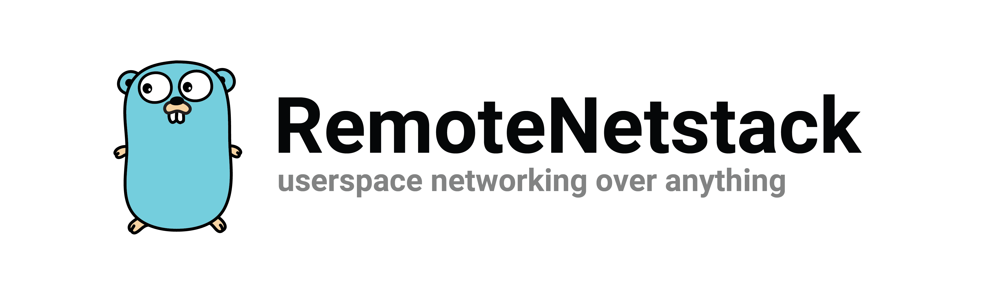

RemoteNetstack provides utilities for running user-space network stacks where the data link layer implementation only needs to implement the `io.Reader` and `io.Writer` interfaces. This single abstraction allows for interesting functionality, like the ability to dial through an existing connection, and out of a user-space networking stack located on another physical machine, effectively acting as a remote network interface.


This project maintains the core primitive that makes this work [`netstack.Endpoint`](netstack/channel.go) as well as some other useful utilities.
* Custom data link layer [using libp2p streams](#libp2p) as the underlying transport. Any libp2p host can be used as a data link layer by attaching a custom stream handler. This pattern can also be used to make other data link layer implementations like a QUIC-based implementation (coming soon).
* Create HTTP clients using a netstack as the underlying transport.
* Custom TCP and UDP forwarding implementations which allow netstacks to forward TCP requests to the host's TCP stack.

This project is extremely experimental. While most of the heavy lifting is being performed by production-ready projects like gvisor's netstack, and libp2p, the APIs exposed in this project will change until the first major release.

## libp2p
It's very simple to attach a userspace netstack to an existing libp2p host. The following example is not a fully-working example, but does show the basic idea.

```go
// Create a netstack and channel endpoint
s := stack.New(stack.Options{})
e := channel.New(128, 1024, "")
s.CreateNIC(1, e)

// Create a libp2p host
host, err := libp2p.New(...)
if err != nil {
    panic(err)
}

// Initialize the p2p netstack protocol. This effectively attaches the netstack 
// above to the libp2p host. Packets sent to this libp2p host using the appropriate 
// protocol will be forwarded and handled by the netstack.
_, err = p2p.New(host, e)
if err != nil {
    panic(err)
}
```

## Thanks
This projects only provides utilities on top of the following great projects:
* [gvisor (netstack)](https://gvisor.dev/)
* [libp2p](https://libp2p.io/)